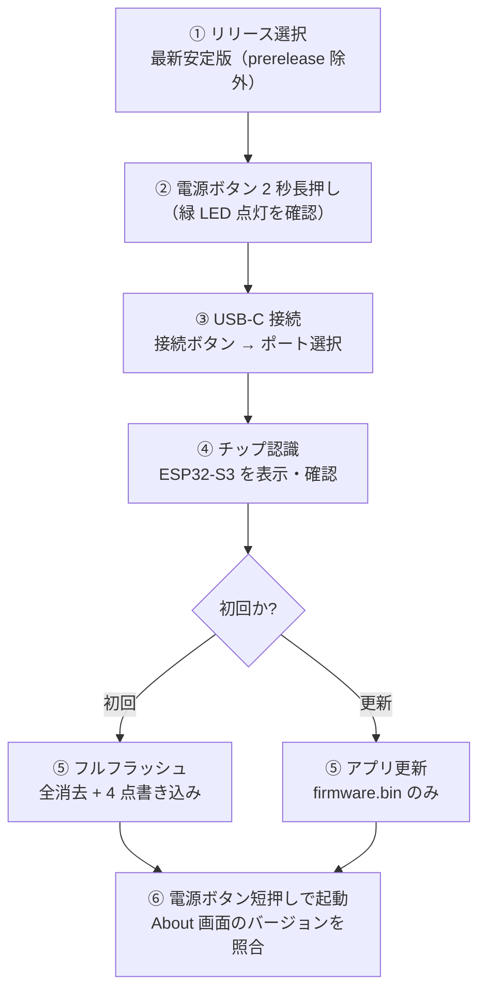
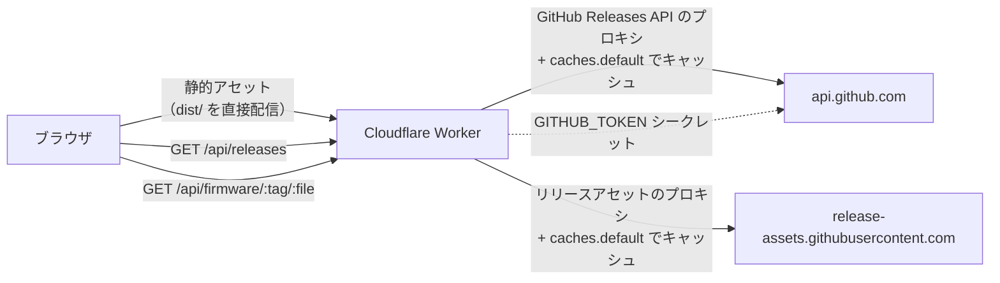
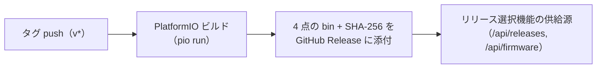
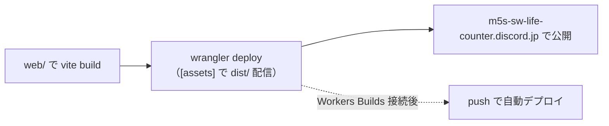

# Web フラッシャー設計（ブラウザから M5Stack StopWatch への書き込み）

M5Stack StopWatch Dev Kit（ESP32-S3）に、ブラウザからファームウェアを書き込む Web アプリの設計である。Web Serial API と esptool-js を用い、装置固有のダウンロードモード操作（電源ボタン長押し）をウィザードで案内する方式を採用する。ホスティングは Cloudflare Workers、書き込み対象は GitHub Releases のリリース選択 UI から選択する。

**関連ドキュメント**: [ハードウェア仕様](./01-hardware.md) | [開発環境](./02-dev-environment.md) | [開発ワークフロー](./03-dev-workflow.md) | [実装ロードマップ](./12-roadmap.md) | [技術選定記録](./13-decisions.md)

## 1. 結論（フィージビリティ判定）

**判定: ブラウザからの書き込みは実現可能である。WebUSB ではなく Web Serial API + esptool-js（Espressif 公式）を採用する。**

### WebUSB が不可の理由

- ESP32-S3 のネイティブ USB は OS から **CDC-ACM（シリアル）デバイス**として認識される
- WebUSB の仕様上、OS のクラスドライバにバインドされた既存クラス（CDC-ACM 等）は Web アプリから排他アクセスできない。WebUSB でアクセスできるのは複数インターフェース構成のうち OS が占有しないインターフェースのみであり、本デバイスは単一 CDC インターフェース構成である
- 実際、Espressif 公式の esptool-js も ESP Web Tools も WebUSB ではなく **Web Serial API ベース**で実装されており、業界の事実上の標準も Web Serial である

### Web Serial + esptool-js で可能な理由

- Web Serial API は OS のシリアルポート層を扱うため、CDC-ACM デバイスを直接操作できる（Chrome / Edge 89+）
- esptool-js は ESP32-S3 の書き込みプロトコル（USB Serial/JTAG 経由を含む）を実装済みで、PID 0x1001（USB-JTAG-Serial）検出時の自動リセット処理（`usbJTAGSerialReset`。Python 版 esptool では `usb_jtag_serial_reset`）も組み込まれている
- 実績: ESP Web Tools（esptool-js ベース）は WLED / Tasmota / ESPHome など多数のプロジェクトでブラウザ書き込みを提供しており、M5Stack 公式も CoreS3 のファクトリ復元に採用している

## 2. 対象デバイスと書き込み対象バイナリ

### 対象デバイス

M5Stack StopWatch Dev Kit（ESP32-S3、SKU C152）。詳細は [ハードウェア仕様](./01-hardware.md) を参照。Web フラッシャー設計に関わる要点:

| 項目 | 内容 |
|---|---|
| MCU | ESP32-S3R8（16 MB Flash / 8 MB PSRAM） |
| USB | ネイティブ USB（USB Serial/JTAG + USB-CDC）。変換 IC なし、macOS ドライバ不要（`/dev/cu.usbmodem*`） |
| ダウンロードモード移行 | **電源ボタン約 2 秒長押し（緑 LED 点灯まで）**。Boot ボタン（GPIO0）押下 + 抜き差しは不要（強制ブートローダーモードは文鎮化時の保険） |
| ポートの 2 段構成 | ダウンロードモード時 = ROM の USB Serial/JTAG（PID 0x1001）、アプリ起動時 = アプリの USB-CDC（PID 0x303A） |
| 書き込み後のリセット | 自動リセット（RTS 経由）だけでは起動しないことがあるため、**電源ボタン短押しの手動リセットが必要な場合がある** |

### 書き込み対象バイナリ（.pio/build/m5stack-stopwatch/ の成果物）

| ファイル | サイズ（現行ビルド） | 書き込みオフセット | 備考 |
|---|---|---|---|
| bootloader.bin | 15,104 B | 0x0 | ESP32-S3 ではブートローダのオフセットは 0x0 |
| partitions.bin | 3,072 B | 0x8000 | default_16MB.csv（OTA 2 スロット構成） |
| boot_app0.bin | 8,192 B | 0xe000 | OTA データパーティション初期化バイナリ（フルフラッシュ時に必須） |
| firmware.bin | 522,032 B | 0x10000 | app0 領域（サイズ 0x640000） |

### merged.bin の要否判断: **不要**

- esptool-js は複数ファイル + オフセット指定の書き込みをネイティブサポートしており、Web Serial で逐次転送できる
- merged.bin は「単一ファイルの一括配布」のための形式であり、Web フラッシャーには利点がない
- **boot_app0.bin は必須**である。boot_app0.bin は OTA データパーティション（otadata、0xe000）の初期化バイナリであり、ブートローダーが起動スロット（app0 / app1）を決定するために必要である。これはブートローダーオフセット（ESP32: 0x1000 / ESP32-S3: 0x0）の違いとは無関係であり、ESP32-S3 でも必要である。フルフラッシュ（全消去）後に boot_app0.bin を書き込まないと、ブートローダーが起動スロットを決定できず黒画面になる
- フルフラッシュは **4 点書き込み**（bootloader.bin: 0x0 / partitions.bin: 0x8000 / boot_app0.bin: 0xe000 / firmware.bin: 0x10000）である
- **バージョンの単一情報源は GitHub Releases のタグ（v*）とする**。merged.bin は作らず 4 点個別書き込みのまま（リリース選択 UI がタグ名でバージョンを表示する）

## 3. 技術選定: ESP Web Tools と esptool-js 直接利用の比較

### 比較表

| 観点 | ESP Web Tools（esp-web-install-button） | esptool-js 直接利用（カスタム UI） |
|---|---|---|
| 実装工数 | 低（Web Components を埋めるだけ） | 中〜高（状態管理・進捗 UI を自前実装） |
| カスタマイズ自由度 | 制限あり。manifest.json 駆動の固定フロー | 完全自由 |
| 日本語 UI | 標準 UI は英語。文言差し替えに制約 | 完全な日本語化が可能 |
| 装置固有フロー | manifest の metadata に説明文は書けるが、ステップバイステップのウィザード誘導は困難 | 電源ボタン長押し → 接続 → 起動確認までウィザードで誘導できる |
| 書き込み制御 | erase_first 等、manifest に書けるオプションは限定的 | esptool-js API を直接呼び、接続モード（`no_reset` 等）・erase / app のみ書き込み等を細かく制御 |
| ブランディング | 部品の見た目に制約 | ライフカウンター配布ページのデザインに完全統合 |
| 将来の切替 | — | manifest.json を ESP Web Tools 互換フォーマットで持てば後から切替可能 |
| 依存 | 1 ライブラリ（内部で esptool-js を使用） | esptool-js のみ。UI は自前 |

### 推奨: esptool-js 直接利用 + カスタムウィザード UI

理由は以下の 3 点である。

1. **装置固有の操作案内が必須**: 本デバイスは DTR/RTS 自動リセットで書き込みモードに入らない。電源ボタン 2 秒長押し（緑 LED 確認）→ USB 接続 → 書き込み → 電源ボタン短押しで起動、という手動操作のウィザード誘導が必須であり、ESP Web Tools の固定フローでは自然に挟めない
2. **日本語 UI とブランディング**: ライフカウンターの配布・更新ページとして、アプリの世界観に合わせたデザインと言語が必要である
3. **実装コストは許容範囲**: 配布対象は現時点では個人利用が主であり、esptool-js の API はシンプル（`writeFlash` 等）であるため、自前 UI（リリース選択 + ウィザード）の実装は現実的である

### 接続戦略の設計（ダウンロードモード前提）

- 前提: ユーザーは**事前に電源ボタン 2 秒長押しでダウンロードモードに入れる**。この状態でポートが PID 0x1001（USB Serial/JTAG）として列挙される
- **接続時のリセット抑止は mode 指定が正規手段である**（`resetBefore` / `resetAfter` というオプションは esptool-js v0.6.1 には存在しない）。接続 API は以下のとおり:
  - 接続: `connect(mode)` / `main(mode)`。`mode` は `Before = "default_reset" | "usb_reset" | "no_reset" | "no_reset_no_sync"`（※ webserial.ts の `Transport.connect()`（引数なし・ポートオープンのみ）とは別物。`ESPLoader.connect(mode, attempts, detecting)` はモード付きでリセットシーケンスまで実行する）
  - 接続後: `after(mode)`。`mode` は `After = "hard_reset" | "soft_reset" | "no_reset" | "no_reset_stub" | "custom_reset"`
- **PID 0x1001 検出時は、mode が `"no_reset"` 以外のとき `usbJTAGSerialReset` が無条件に実行される**（確定的挙動。constructResetSequence がリセットシーケンスを組み立て、`"no_reset"` 指定時は空を返す）
- 本設計ではユーザーが電源ボタン長押しでダウンロードモードに入っているため、**接続は `main("no_reset")` を指定し、リセットを一切実行しない**。これにより USB 再列挙によるポートハンドル喪失も起きない
- **書き込み後も `after("no_reset")` でリセットせず、電源ボタン短押しによる手動リセットの案内に委ねる**: 本デバイスは自動リセットでは起動しないことがある実測知見がある（[技術選定記録](./13-decisions.md) の実測記録）。電源ボタン短押しの案内はウィザードの完了ステップに必ず含める（検証は [検証事項](#-11-検証事項) V-4）
### ポート喪失からの復帰

- usbJTAGSerialReset の実行時やチップリセット時に USB が再列挙され、開いていたポートハンドルが無効化される環境がある
- esptool-js v0.6.0 以降の復帰 API を利用する:
  1. `setDeviceLostCallback(cb)` でポート喪失を検知する
  2. `navigator.serial.getPorts()` でポートを再取得する（Web Serial の権限はオリジン単位のため再選択は不要）
  3. `transport.updateDevice(device)` でポートを差し替えて書き込みを継続する
- 本設計では `main("no_reset")` により再列挙自体を回避できるため、この復帰パターンは保険的な実装として組み込む（[検証事項](#-11-検証事項) V-5 と関連）

## 4. ユーザーフロー（ウィザード設計）



### 各ステップの詳細

**① リリース選択**（新設）

- `/api/releases` から GitHub Releases の一覧を取得し、書き込むバージョンを選択する（詳細は §5「リリース選択機能の設計」）
- 既定は**最新安定版**（`prerelease: false` の最新リリース）。prerelease は「試験版」と明示表示し、既定選択にしない。**安定版が 0 件の場合**は prerelease を選択肢に表示するが、既定では選択せず、ユーザーの明示選択を必須とする
- 各リリースに表示する情報: バージョン（タグ名）・公開日・リリースノート・添付 4 点（bootloader / partitions / boot_app0 / firmware）のサイズと **SHA-256**
- デバイス側バージョンとの比較: 書き込み完了後に About 画面（`kFirmwareVersion`）の表示と照合する形で案内する（Web 側からデバイス内のバージョンを読む手段はないため）
- **リリースが無い場合**: 「初回セットアップは CI で `v*` タグの Release を作成する必要があります」と案内する（§6 (a) 参照）
- 一覧取得失敗時: ネットワーク確認とリトライを案内し、キャッシュがあれば表示する（フェイルオープン）

**② ダウンロードモード移行**

- 「電源ボタンを約 2 秒長押しし、緑 LED が点灯したら離してください」を大きく表示する
- 緑 LED が出ない場合の対処（下記エラーフロー）へのリンクを併記する
- ダウンロードモードは**無期限に待機し続ける**（タイムアウトなし）ため、書き込みを中断して放置するとバッテリーを消費し続ける。ページ上に「書き込みを中断する場合は電源ボタン短押しで通常起動に戻すか、素早く 2 回押しで電源を切ってください（01-hardware.md 参照）」等の注意書きを表示する

**③ 接続**

- 「接続」ボタン（ユーザージェスチャ必須）→ ブラウザのポート選択ダイアログを表示する
- **ポートフィルタは不使用（全ポート表示）**: 本デバイスは状態で PID が 0x1001 ⇔ 0x303A と変わるため、VID/PID フィルタをかけるとどちらかの状態でしか表示されない。全ポート表示にし、選択ダイアログのヒント（「USB Serial」「/dev/cu.usbmodem*」等）を表示する
- 再接続時は `getPorts()` で接続済みポートを復元表示し、選択を省略できる

**④ チップ認識**

- esptool-js でチップ情報を取得し「ESP32-S3 を検出しました」と表示する
- 選択中のリリース（書き込むバージョン）をあわせて表示する
- Web 側の期待チップと不一致の場合は中断し、ダウンロードモードへの再移行を案内する

**⑤ 書き込み**

- **初回（フルフラッシュ）**: `erase_flash`（全消去）→ 選択リリースの bootloader + partitions + boot_app0 + firmware の 4 点書き込み。NVS（ゲーム履歴・設定）も消えるため、実行前に警告を表示する
- **更新時**: 選択リリースの firmware.bin（app0 領域 0x10000）のみ書き込み。**NVS の保存データは温存される**（パーティション構成上 app0 と nvs 領域は独立。実機確認は [検証事項](#-11-検証事項) V-8）
- 進捗表示: パーセント・転送バイト数を表示する。失敗時はリトライ案内に遷移する
- **writeFlash の引数仕様**（v0.6.1）: `{ fileArray: { data: Uint8Array; address: number }[], flashMode, flashFreq, flashSize, eraseAll: boolean, compress: boolean, reportProgress?: (fileIndex, written, total) => void }`
  - `data` は **Uint8Array 必須**（v0.6.0 の破壊的変更）。`/api/firmware/:tag/:file` のレスポンスは `new Uint8Array(await res.arrayBuffer())` で変換して渡す
  - `eraseAll` は stub 実行中のみ有効（stub が動作しないポートでは無視される）
  - 書き込み後のリセットは writeFlash の引数ではなく `after(mode)` で行う（本設計では `after("no_reset")`）

**⑥ 完了**

- 「電源ボタンを短押しして起動してください」を案内する
- 起動後、About 画面（`drawAbout()` が表示する `kFirmwareVersion`）と**選択したリリースのバージョン**の照合を促す

### エラーフロー

| 症状 | 主な原因 | 案内 |
|---|---|---|
| リリース一覧が取得できない（空・API エラー） | ネットワーク障害 / リリース未作成 / GitHub API のレートリミット | ネットワーク確認とリトライを案内。**初回は CI で `v*` タグの Release 作成が必要**な旨を表示。キャッシュがあれば表示する（フェイルオープン） |
| リリースのバイナリが取得できない | アセット欠落 / リポジトリの公開範囲 | リリース構成（4 点の bin + SHA-256）の確認を促す。Worker ログでエラー原因を調査 |
| 緑 LED が出ない | 長押しが 2 秒未満 / 電源 OFF / バッテリー残量不足 | 「もう一度、電源ボタンを約 2 秒長押し」を案内し、バッテリー残量の確認を促す |
| 長押ししすぎて電源が切れた | 長押しの継続による電源 OFF（素早く 2 回押し = 電源 OFF の誤操作も同症状。01-hardware.md 参照） | 電源ボタン短押しで電源 ON → 再度 2 秒長押しでダウンロードモードへ入る手順を案内する |
| ポート選択にデバイスが出ない | 充電専用ケーブル / 他タブ・シリアルモニタの占有 | データ通信対応ケーブルへの交換、他タブ・シリアルモニタを閉じる、ブラウザ再起動を案内する |
| 接続できたがチップ認識に失敗 | ダウンロードモードに入らず、アプリ側 CDC（PID 0x303A）に接続してしまった | ②の手順（電源ボタン 2 秒長押し）へ戻す案内を表示する |
| 書き込み中に失敗 | ケーブル抜け / タブを閉じた / OS スリープ | 最初からやり直し。書き込み中はタブを閉じない警告を再表示する |
| 書き込み成功後、起動しない | 自動リセットのみでは起動しないケース | 電源ボタン短押しを案内する。それでも起動しなければ強制ブートローダーモード（Boot ボタン押下 + USB 抜き差し）を案内する |

## 5. Web アプリ構成

### 全体方針: Cloudflare Workers 上の静的サイト + API プロキシ

- ホスティングは **Cloudflare Workers**（wrangler v4）。静的アセット（`dist/`）の直接配信と、GitHub Releases を中継する API プロキシ（`/api/*`）を 1 つの Worker で提供する
- **GitHub Pages 案は廃止**（ユーザー決定）。Vite の `base` 設定は不要（ルート配信）
- カスタムドメイン **m5s-sw-life-counter.discord.jp** で公開する（workers.dev サブドメインも引き続き有効）。無料プランは 100,000 req/日
- Web Serial は **HTTPS 必須**（localhost は例外）。Cloudflare Workers は自動で HTTPS を提供するため要件を満たす

### アーキテクチャ図



- アセット配信の既定動作は「アセットに一致するパスは Worker コードを実行せず直接配信、不一致のパスは fetch ハンドラ」である。`/api/*` をハンドラで処理し、それ以外は `env.ASSETS.fetch(request)` にフォールバックする標準パターンとする
- 書き込み対象のバイナリは GitHub Releases のリリースアセットから取得する（詳細は下記「リリース選択機能の設計」）

### wrangler.toml の構成例

```toml
name = "m5s-sw-life-counter-flasher"
main = "src/worker.ts"
compatibility_date = "2026-08-18"

[assets]
directory = "./dist/"
binding = "ASSETS"

[vars]
GITHUB_REPO = "owner/m5s-sw-life-counter"   ; 所有者/リポジトリ名
```

- `GITHUB_TOKEN` は vars ではなく**シークレット**として設定する: `wrangler secret put GITHUB_TOKEN`（公開リポジトリの読み取りならスコープ不要。レートリミットは未認証 60 req/h に対し 5,000 req/h に改善。リポジトリが private の場合も同一シークレットで対応可）
- `@cloudflare/vite-plugin` は開発体験用（`wrangler dev` での HMR 等）であり必須ではない。`vite build` で生成した `dist/` を `[assets]` に指定するだけで配信できる

### 技術スタックの比較と推奨

| 案 | 利点 | 欠点 | 判定 |
|---|---|---|---|
| **Vite + TypeScript** | esptool-js の型定義を利用でき型安全。開発体験・保守性が高い | ビルドステップが必要 | **推奨** |
| 素の HTML + CDN ESM（importmap） | 依存最小、ビルド不要、Workers アセットにそのまま配置可能 | 型なし、複数ファイルの管理が煩雑 | 条件付き可 |
| 素の HTML + 単一 JS（手書き） | 最小構成 | 保守性が低い | 不採用 |

**推奨: Vite + TypeScript**。esptool-js は npm パッケージ（型定義付き）で提供されており、書き込み状態遷移（リリース選択 → 接続 → 認識 → 書込中 → 完了 / 失敗）を型安全に実装できる。ビルド成果物 `dist/` を Workers の `[assets]` に指定して配信する。

### 配置場所

本リポジトリの **`web/` サブディレクトリ**（決定済み）。`web/` 配下は独立した Vite プロジェクトとし、`src/worker.ts`（Workers ハンドラ）もここに置く。ファームウェア実装（`src/`）とは依存関係を持たない。

### リリース選択機能の設計

**一覧取得（/api/releases）**

- GitHub Releases API（`api.github.com/repos/{owner}/{repo}/releases`）のプロキシである
- GitHub API は CORS `*` を返すが、**未認証では 60 req/h/IP のレートリミット**があるため、ブラウザから直接呼ばず Worker 経由で取得する
- `caches.default`（Cache API）でレスポンスをエッジキャッシュし、**フェイルオープン**（キャッシュがあれば API エラー時にも表示）で動作させる。キャッシュキーは **tag 別**（`releases:<tag>` 単位）とし、**TTL は 5 分**（新規リリースの反映遅延を抑える短 TTL）とする

**選択 UI**

- リリース一覧（タグ名・公開日・リリースノート・prerelease フラグ）を表示し、既定は最新安定版（`prerelease: false` の最新）
- 各リリースのアセット（bootloader / partitions / firmware / SHA-256）を選択時に表示する
- 書き込み対象（フルフラッシュ時 4 点 / 更新時 1 点）と合計サイズを確認ダイアログで表示する

**バイナリ取得（/api/firmware/:tag/:file）**

- **リリースアセットのバイナリはブラウザから直接 fetch 不可**である（`browser_download_url` → 302 → `release-assets.githubusercontent.com` が CORS ヘッダーを返さない。実測確認済み）。`<a download>` ではダウンロードできるが、esptool-js は fetch 必須のため **Worker プロキシが必須**である
- Worker のサーバー側 fetch は CORS の対象外であり、`browser_download_url` を追跡してバイナリを取得できる
- レスポンスは `application/octet-stream` で返し、`caches.default` でキャッシュする。キャッシュキーには **`:tag/:file` を含める**（タグ単位で一意）。リリースは不変（アセットは差し替えられず追加のみ）前提のため **TTL は 7 日**の長 TTL とする

**エラー時挙動**

- リリースが無い場合: 「初回セットアップは CI で `v*` タグの Release を作成する必要があります」と案内する（§6 (a) 参照）
- 一覧 API エラー: フェイルオープン（キャッシュ表示）+ リトライ案内
- バイナリ取得エラー: リリース構成（4 点 + SHA-256 の添付）の確認を促す

### MIME とバイナリ配信

- `.bin` は **`application/octet-stream`** で配信する（Worker プロキシのレスポンスで Content-Type を明示する）
- ブラウザ側の fetch は **`cache: 'no-store'`** を指定し、更新後のバイナリがブラウザキャッシュに残らないようにする（キャッシュは Worker 側の Cache API で一元管理する）

### manifest.json 案（ESP Web Tools フォーマット互換）

esptool-js 直接利用でも、書き込み対象（オフセット等）の情報はこのファイルに集約する。ESP Web Tools のフォーマット互換にしておくことで、将来「インストールボタン 1 つ」の配布形態へ低コストで切り替えられる。

```json
{
  "name": "M5Stack StopWatch Life Counter",
  "version": "0.2.0",
  "new_install_prompt_erase": true,
  "builds": [
    {
      "chipFamily": "ESP32-S3",
      "parts": [
        { "path": "bin/bootloader.bin", "offset": 0 },
        { "path": "bin/partitions.bin", "offset": 8192 },
        { "path": "bin/boot_app0.bin", "offset": 57344 },
        { "path": "bin/firmware.bin", "offset": 65536 }
      ]
    }
  ]
}
```

- `new_install_prompt_erase`: ESP Web Tools の「新規インストール時は全消去を確認する」挙動のスイッチ。更新時には該当しないため、NVS 温存の運用と整合する
- **表示上のバージョンはタグ名を優先する**。manifest.json の `version` は ESP Web Tools へ切り替えた際の互換情報に過ぎず、Web アプリの表示や書き込み可否の判定には使わない
- カスタム UI 側はこの manifest の `parts` 情報を、選択したリリースのアセット（`/api/firmware/:tag/:file`）に当てはめて書き込みリストを組み立てる

## 6. ビルド → デプロイパイプライン

ファームウェアのリリース（GitHub Actions）と Web アプリのデプロイ（Cloudflare Workers）の **2 本立て**で構成する。

### (a) ファームウェアリリース: GitHub Actions（tag → ビルド → Release 添付）



1. **トリガー**: `v*` タグの push（または Release 作成）
2. **ファームウェアビルド**: ubuntu-latest 上で PlatformIO Core をインストールし `pio run -e m5stack-stopwatch` を実行する（初回のツールチェーン導入は時間がかかるため、`actions/cache` によるキャッシュ適用を任意検討事項とする）
3. **Release 作成**: アセット名は固定規約 **`bootloader.bin` / `partitions.bin` / `boot_app0.bin` / `firmware.bin`** とし、`sha256sums.txt`（形式: `<hash>  <filename>`、`sha256sum -b` 相当。スペース 2 個区切り）を生成して Release アセットとして添付する（`softprops/action-gh-release` 等を使用）
4. **バージョン照合**: タグ名（`v*`）がバージョンの単一情報源である。Web 側はタグ名を表示し、About 画面の `kFirmwareVersion`（現状 `"0.2.0"`）との照合をユーザーに促す
5. **SHA-256 照合（Web 側）**: Web アプリは Worker プロキシで取得した各バイナリの SHA-256 を自動計算し、`sha256sums.txt` と照合する。**不一致の場合は書き込みを中止**し、再取得を案内する

### (b) Web アプリデプロイ: Cloudflare Workers



1. **初回（手動）**: `wrangler login` → `web/` で `npm run build` → `wrangler deploy`
2. **自動化（Workers Builds）**: Cloudflare Dashboard → Worker → Settings → Builds → Connect（GitHub App）でリポジトリ/ブランチを接続する。設定値:
   - ビルドコマンド: `npm run build`（任意）
   - デプロイコマンド: `npx wrangler deploy`（デフォルト）
   - Root directory: `web/`
   - push で自動デプロイ。無料プランは 3,000 build-min/月。デプロイ用トークンは Cloudflare が自動生成する（GitHub 側のシークレットは不要）
3. **非対話デプロイ**（CI から wrangler を使う場合）: `CLOUDFLARE_API_TOKEN`（Workers Scripts: Edit 権限）+ `CLOUDFLARE_ACCOUNT_ID` を設定する
4. **注意**: wrangler 4.108.0 以降、非対話デプロイは Worker 名の所有権を証明できない場合にサイレント上書きを停止する（`--force` で回避）。**初回デプロイは対話（`wrangler login`）で行い、所有権を確定させてから自動化に移る**こと

## 7. ブラウザ / OS サポート

| 環境 | 対応 | 備考 |
|---|---|---|
| Chrome 89+（Windows / macOS / Linux / ChromeOS） | ○ | Web Serial API。開発・実運用の対象 |
| Edge 89+ | ○ | Chromium ベース。動作は Chrome と同等 |
| Safari（macOS / iOS） | × | Web Serial 未実装。機能を隠すのではなく非対応メッセージを表示する |
| Firefox | × | 既定では未実装。同様に非対応メッセージを表示する |
| Android Chrome | × | Web Serial はデスクトップ向け。モバイルでの書き込みは対象外（WebUSB は Android 対応だが CDC 占有のため使用不可） |
| macOS | ○ | ネイティブ USB のためドライバ不要（macOS 11 以降ドライバレス認識、`/dev/cu.usbmodem*`） |

### 既知の問題と回避手順

- **Chrome v139 の SerialSplitDtrAndRts バグ**: DTR/RTS 制御の分離変更により、一部の書き込みフローで異常が報告されている。回避は Chrome 起動時のフラグ追加である:
  - macOS: `open -a "Google Chrome" --args --disable-features=SerialSplitDtrAndRts`
  - Windows / Linux: ショートカットの起動オプションに `--disable-features=SerialSplitDtrAndRts` を追加
  - 回避手順はサポートページに記載し、v140+ での修正状況を追跡する（[検証事項](#-11-検証事項) V-7）
- **充電専用ケーブル**: ポートに列挙されない（README にも既記載の注意事項。エラーフローで案内する）
- **他タブ・シリアルモニタの占有**: ポートは単一プロセスが排他オープンするため、他で開いていると接続エラーになる

## 8. セキュリティ・UX 考慮

| 項目 | 設計 |
|---|---|
| ユーザージェスチャ必須 | `requestPort()` はクリック等のユーザージェスチャ内でのみ呼ぶ。ウィザードの「接続」ボタン押下時のみ実行する |
| HTTPS 必須 | Web Serial はセキュアコンテキスト必須（localhost は例外）。Cloudflare Workers の自動 HTTPS（m5s-sw-life-counter.discord.jp / workers.dev）で充足 |
| バイナリ配信経路 | ファームウェアバイナリは Worker プロキシ（`/api/firmware/:tag/:file`）経由でのみ取得する。CORS のない GitHub 直接 URL へは誘導しない |
| 意図しない書き込み防止 | 書き込み実行前に確認ダイアログで「対象デバイス（チップ種別）・書き込みファイル一覧（フルフラッシュ時 4 点 / 更新時 1 点）・各サイズ・SHA-256」を表示し、明示的な同意を得る |
| SHA-256 表示 | manifest と実バイナリのハッシュを表示し、配布物の同一性確認と改ざん・破損の検知を可能にする |
| 書き込み中の注意 | 「書き込み中はタブを閉じない・ケーブルを抜かない」を進捗画面に常時表示する。タブを閉じると書き込みが中断され、デバイスが不完全な状態になり得る |
| erase の警告 | 初回の全消去では NVS（ゲーム履歴・設定）も消えることを警告する。既定は「更新（app のみ）」とし、NVS を温存する |
| ポート解放 | 書き込み完了後は必ず `port.close()` し、他のツール・タブで使える状態に戻す |
| 権限モデル | Web Serial の権限はオリジン単位。`getPorts()` で接続済みポートを復元でき、再訪時の UX 向上に利用する |
| 依存の最小化 | CDN に頼らずビルド時にバンドルする（サプライチェーンリスクとネットワーク非依存の確保） |

## 9. 実装ステップ（マイルストーン）

| マイルストーン | 内容 | 検証方法 |
|---|---|---|
| **M0: 接続モック** | Vite + TypeScript の雛形作成。`/api/releases` のモック（ローカル開発時は GitHub API 直叩きのフォールバック）とリリース選択 UI。ポート列挙・接続・チップ情報取得のみ（書き込みはしない） | リリース一覧が表示され、Chrome でポート選択ダイアログが開き、ESP32-S3 のチップ情報が読めることを確認。**接続（`main(mode)`）時の自動リセットでポートハンドルがどうなるかも観察する**（`"no_reset"` / `"default_reset"` / `"usb_reset"` の 3 モードの違い） |
| **M1: 書き込み実行** | esptool-js 統合。`/api/firmware/:tag/:file` 経由のバイナリ取得、進捗 UI・確認ダイアログ・エラーフロー実装 | 実機で firmware.bin のみ書き込み → 起動確認（既存実機を壊さない最小変更で検証） |
| **M2: フルフラッシュ検証** | 初回フルフラッシュ（全消去 + 4 点）の検証。バージョン照合・エラーフロー・更新フロー（NVS 温存）の実機確認。**前提: 着手前に §6 (a) のリリース CI を構築し、v* タグで Release を 1 件作成しておく**（リリース選択機能の実データ確認のため） | **実機で最初に 1 回、フルフラッシュで起動確認**（boot_app0.bin を含む 4 点書き込みで起動すること、更新で NVS が温存されること、電源ボタン短押しで起動することを確認） |
| **M3: デプロイ** | wrangler deploy（初回は手動）→ Workers Builds で GitHub 接続による自動デプロイ | HTTPS サイトからリリース選択 → 実機書き込みが完走することを確認 |

### 実機検証時の注意

- M1 の最初の実機検証は、**万が一失敗しても復旧可能な手順（強制ブートローダーモード: Boot ボタン押下 + USB 抜き差し）を準備してから行う**
- M1 では書き込み対象を既知の正常な firmware.bin に限定し、M2 で初回ユーザー相当のフロー（全消去 → 4 点書き込み）を検証する
- 検証結果は [技術選定記録](./13-decisions.md) の実測記録に追記する

## 10. 決定事項と残りの確認事項

### 決定済み（ユーザー決定）

| # | 決定 | 内容 |
|---|---|---|
| D-1 | ホスティング | **Cloudflare Workers**（GitHub Pages 案は廃止）。wrangler でデプロイし、Workers Builds で自動化 |
| D-2 | 配布 | GitHub Releases（タグ v*）基準の**リリース選択 UI** を実装 |
| D-3 | 置き場所 | 本リポジトリの **`web/` サブディレクトリ** |
| D-4 | バイナリ | **merged.bin は作らない**（4 点個別書き込みのまま）。バージョンの単一情報源は GitHub Releases タグ |

### 残りの確認事項

| # | 確認事項 | 判断の影響 |
|---|---|---|
| Q-1 | リポジトリは public か private か | GITHUB_TOKEN は設計上シークレット前提でどちらでも対応可。ただし **private の場合も Worker プロキシ（/api/releases・/api/firmware）経由ではバイナリが誰でも取得可能になる（公開配信になる）**点を認識して選択する |
| Q-2 | ~~workers.dev サブドメインでよいか、カスタムドメインを使うか~~ | **解決済み**: カスタムドメイン **m5s-sw-life-counter.discord.jp** を使用する（wrangler.toml に `[[routes]]` で設定済み。workers.dev サブドメインも引き続き有効） |
| Q-3 | デバイス側バージョンとの比較表示に「前回書き込み履歴」（localStorage）を入れるか | 比較表示の UX 実装範囲に影響する |

## 11. 検証事項

| # | 検証内容 | 理由・影響 |
|---|---|---|
| V-1 | ~~boot_app0.bin なしの 3 点書き込みで起動するか~~ **検証済み（2026-08-19）: 実機で黒画面を確認。boot_app0.bin（0xe000）が必須と確定** | boot_app0.bin なしではブートローダーが起動スロットを決定できず黒画面になる。フルフラッシュは 4 点書き込み（0x0 / 0x8000 / 0xe000 / 0x10000）に修正済み |
| V-2 | erase_flash の所要時間 | 16 MB 全消去の実測。進捗 UI の期待値とタイムアウト設定に使用する |
| V-3 | (a) `main("no_reset")` で接続時リセットを抑止した状態で、ダウンロードモードのデバイスに正常に sync できるか。(b) 抑止せず `usbJTAGSerialReset` を実行した場合のモード遷移とポートハンドル挙動 | 本設計の接続戦略（`no_reset` 前提）の成立性と、誤接続時の影響範囲を確定する |
| V-4 | 書き込み後の自動リセット（`after("hard_reset")`）の成功率と、電源ボタン短押しでの起動 | 完了ステップの文言（手動リセット案内の要否）を確定する。本設計は `after("no_reset")` + 電源ボタン短押しが既定だが、hard_reset が確実に動くなら自動化の余地がある |
| V-5 | チップリセット後のポート再列挙と、開いていたポートハンドルの無効化挙動 | 書き込み完了後・失敗後の再接続フローの実装に影響する |
| V-6 | 充電専用ケーブルでのポート非表示の再現確認 | エラーフローの案内文言の根拠とする |
| V-7 | Chrome v139 の SerialSplitDtrAndRts 問題の影響有無 | 回避手順（起動フラグ）の要否を実機で確認する |
| V-8 | 更新フロー（app のみ書き込み）で NVS データが温存されること | パーティション構成上の独立性の実機確認 |
| V-9 | アプリ起動時（PID 0x303A）のポートに接続した場合の挙動 | エラーフロー「ダウンロードモードへ戻す案内」の実装根拠 |
| V-10 | ダウンロードモード中の電源ボタン短押しの実挙動（通常ブートに復帰するか / 電源 OFF になるか） | ウィザードの中断・再開案内の文言（minor 対応で追記した注意書き）を確定する |
| V-11 | `/api/firmware/:tag/:file` プロキシの動作（Cache API ヒット/ミス・Content-Type・バイナリ整合性） | リリース選択機能の要。実機書き込み前にブラウザ単体で検証する |
| V-12 | `/api/releases` のキャッシュ・フェイルオープン動作（GitHub API 障害時の表示） | エラーフロー「リリース一覧が取得できない」の実装根拠 |

---

## 12. ファームウェアバリアント対応

### バリアント別 URL 構成

Web サイトは 2 つのファームウェアバリアント（for FaB / for MTG EDH）に対応する。

| パス | 内容 |
|------|------|
| `/` | トップページ（アプリ紹介 + バリアント選択） |
| `/fab/install` | FaB ファームウェアの書き込みウィザード |
| `/fab/guide` | FaB 使い方ガイド |
| `/fab/features` | FaB 機能一覧 |
| `/edh/install` | EDH ファームウェアの書き込みウィザード |
| `/edh/guide` | EDH 使い方ガイド |
| `/edh/features` | EDH 機能一覧 |
| `/install` | `/fab/install` へリダイレクト（旧 URL 互換） |
| `/guide` | `/fab/guide` へリダイレクト（旧 URL 互換） |
| `/features` | `/fab/features` へリダイレクト（旧 URL 互換） |

旧 URL（`/install`, `/guide`, `/features`）は `<meta http-equiv="refresh">` + JavaScript リダイレクト + 手動リンクで `/fab/*` へ転送する。

### リリース成果物の命名規約

| バリアント | ファームウェアファイル名 | 備考 |
|-----------|----------------------|------|
| FaB | `firmware.bin` | 現行どおり。既存リリースとの互換を維持 |
| EDH | `firmware-edh.bin` | 新規。同一リリースに追加で添付 |

`bootloader.bin` / `partitions.bin` / `boot_app0.bin` / `sha256sums.txt` は両バリアント共通である。

### EDH 未リリース時の挙動

EDH ファームウェアは仕様策定段階であり、現時点でリリース物が存在しない。

- `/edh/install` では、リリース一覧から `firmware-edh.bin` をアセットに含むリリースのみをフィルタ表示する
- フィルタ後のリリースが 0 件の場合、「EDH ファームウェアはまだ公開されていません」という案内を表示する（エラーではなく情報表示）
- リリースが公開されれば、フィルタにより自動的に通常のウィザードが動作する

### バリアント判定

バリアントは URL パス（`/fab/` or `/edh/`）から決定する。クエリパラメータや localStorage には依存しない。`main.ts` 内の `FIRMWARE_FILES_FULL` / `FIRMWARE_FILES_UPDATE` のファームウェアファイル名をバリアントに応じて切り替える。

---

## 付録: ADR 追記の提案

本設計が承認された場合、[技術選定記録](./13-decisions.md) に以下の ADR を追記する（書式は既存 ADR に合わせる）。

> **ADR-19: Web フラッシャー — Web Serial + esptool-js 直接利用（カスタムウィザード UI）を採用**
> - 文脈: ブラウザから M5Stack StopWatch への書き込み手段の選定。WebUSB は CDC-ACM 占有のため不可
> - 決定: Web Serial API + esptool-js を直接利用し、装置固有のダウンロードモード操作（電源ボタン 2 秒長押し）を案内するカスタムウィザード UI を実装する。ホスティングは Cloudflare Workers（静的アセット配信 + GitHub Releases プロキシ `/api/releases`・`/api/firmware/:tag/:file`）とし、書き込み対象はリリース選択 UI で GitHub Releases のアセットから選択する。manifest.json は ESP Web Tools フォーマット互換とし、将来の切替を可能にする
> - 根拠: 本デバイスは DTR/RTS 自動リセットに依存できず、手動ダウンロードモード移行の案内が必須であるため
> - 影響: UI 実装コストは ESP Web Tools 利用より高いが、日本語 UI・ブランディング・書き込み制御（初回全消去 / 更新時 app のみ）を自由に実装できる。リリース選択 UI と Worker プロキシの実装・運用コストが加わる
